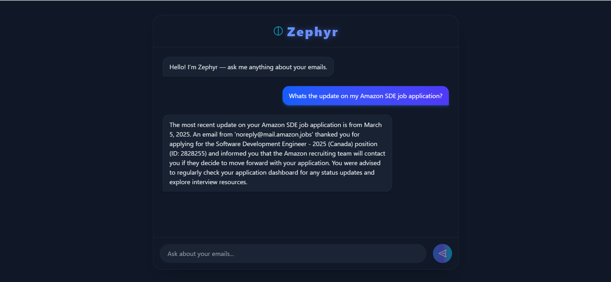

# Zephyr - Personal Email Assistant

An intelligent email assistant that allows you to chat with your inbox. Using a Retrieval-Augmented Generation (RAG) pipeline, it can find and synthesize information from your emails to answer your questions in natural language.

## ✨ Key Features
Web interface: A modern, responsive web UI built with React and Tailwind CSS.

Intelligent Retrieval: Employs a two-stage retrieval system:
 - A SentenceTransformer (bi-encoder) scans thousands of email chunks in milliseconds using a FAISS vector index.
 - A Cross-Encoder re-ranks the top results to find the most contextually relevant information for the specific query.

Context-Aware Answers: The LLM (gpt-5-nano) generates accurate, helpful answers grounded in the actual content and dates of the emails.

## 🚀 Tech Stack
Backend:	Python, Flask, Flask-CORS, FAISS, Sentence-Transformers, OpenAI API, Google Gmail API

Frontend:	React, TypeScript, Vite, Tailwind CSS

## High level architecture diagram

